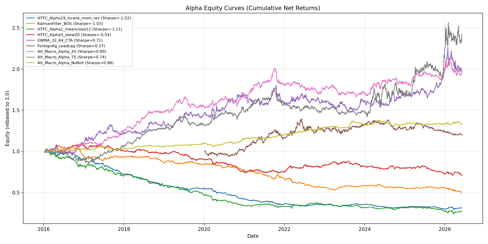
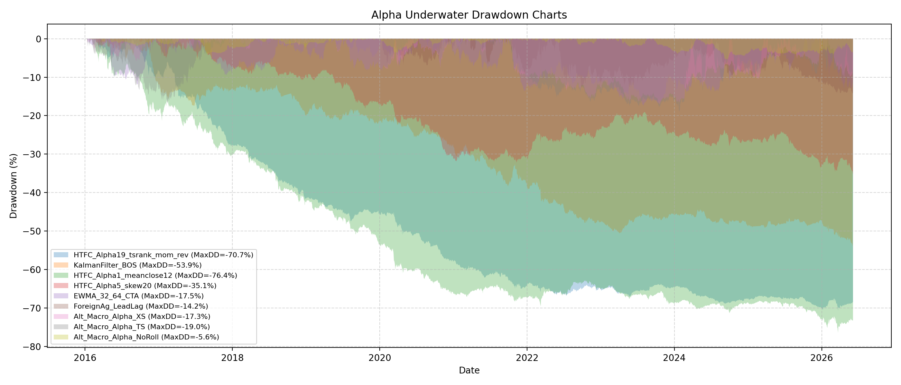
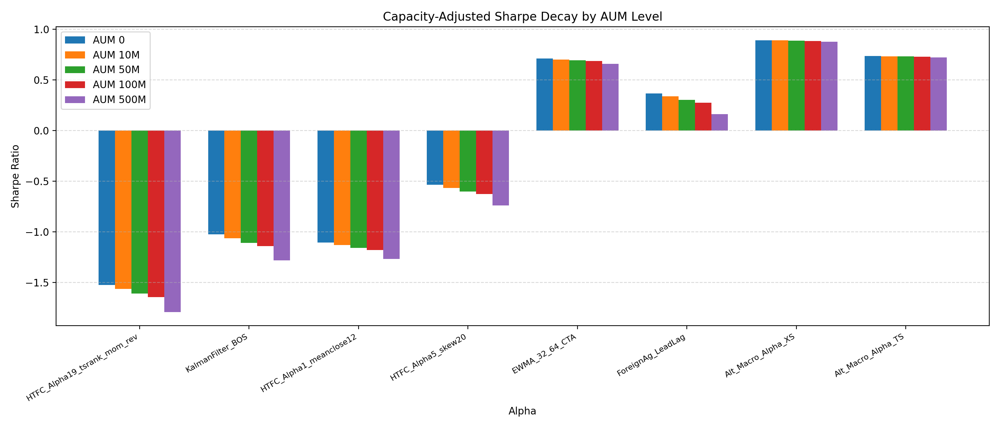

# Alpha Performance Evaluation Report

This report evaluates the performance of the 9 alphas across 23 Chinese commodity futures from 2016 to 2026.

## Performance Metrics Summary Table

| Alpha Name | Ann. Return | Ann. Vol | Sharpe | Deflated Sharpe (DSR) | Calmar | MaxDD | Sortino | Profit Factor | Win Rate | Hit Rate | IC (Rank) |
|---|---|---|---|---|---|---|---|---|---|---|---|
| **HTFC_Alpha19_tsrank_mom_rev** | -11.34% | 7.44% | -1.52 | 0.00% | -0.16 | -70.69% | -1.51 | 0.76 | 44.38% | 49.46% | 0.0094 |
| **KalmanFilter_BOS** | -6.97% | 6.79% | -1.03 | 0.00% | -0.13 | -53.95% | -0.98 | 0.84 | 47.55% | 48.58% | 0.0004 |
| **HTFC_Alpha1_meanclose12** | -12.47% | 11.26% | -1.11 | 0.00% | -0.16 | -76.43% | -1.12 | 0.82 | 46.05% | 49.96% | 0.0038 |
| **HTFC_Alpha5_skew20** | -3.33% | 6.20% | -0.54 | 0.00% | -0.09 | -35.14% | -0.53 | 0.91 | 48.31% | 49.59% | 0.0072 |
| **EWMA_32_64_CTA** | 7.48% | 10.55% | 0.71 | 36.63% | 0.43 | -17.49% | 0.68 | 1.13 | 54.31% | 49.86% | 0.0246 |
| **ForeignAg_LeadLag** | 3.45% | 9.40% | 0.37 | 13.21% | 0.24 | -14.25% | 0.37 | 1.07 | 50.74% | 49.62% | 0.0149 |
| **Alt_Macro_Alpha_XS** | 7.05% | 7.91% | 0.89 | 59.13% | 0.41 | -17.27% | 0.91 | 1.16 | 52.36% | 49.50% | 0.0153 |
| **Alt_Macro_Alpha_TS** | 9.70% | 13.19% | 0.74 | 39.63% | 0.51 | -19.03% | 0.78 | 1.16 | 51.41% | 49.87% | 0.0153 |
| **Alt_Macro_Alpha_NoRoll** | 2.87% | 2.93% | 0.98 | 69.84% | 0.52 | -5.56% | 1.01 | nan | 52.09% | 0.00% | 0.0000 |

---

## Equity Curves

## Drawdown Charts

## Capacity Decay

## Capacity-Adjusted Sharpe Decay Table

This table shows the decay of each alpha's Sharpe ratio at different levels of Assets Under Management (AUM) in RMB.

| Alpha Name | Sharpe at 0 | Sharpe at 10M | Sharpe at 50M | Sharpe at 100M | Sharpe at 500M |
|---|---|---|---|---|---|
| **HTFC_Alpha19_tsrank_mom_rev** | -1.52 | -1.56 | -1.61 | -1.64 | -1.79 |
| **KalmanFilter_BOS** | -1.03 | -1.06 | -1.11 | -1.14 | -1.28 |
| **HTFC_Alpha1_meanclose12** | -1.11 | -1.13 | -1.16 | -1.18 | -1.27 |
| **HTFC_Alpha5_skew20** | -0.54 | -0.57 | -0.60 | -0.63 | -0.74 |
| **EWMA_32_64_CTA** | 0.71 | 0.70 | 0.69 | 0.69 | 0.66 |
| **ForeignAg_LeadLag** | 0.37 | 0.34 | 0.30 | 0.28 | 0.16 |
| **Alt_Macro_Alpha_XS** | 0.89 | 0.89 | 0.89 | 0.88 | 0.87 |
| **Alt_Macro_Alpha_TS** | 0.74 | 0.73 | 0.73 | 0.73 | 0.72 |

## Key Findings and Interpretations

