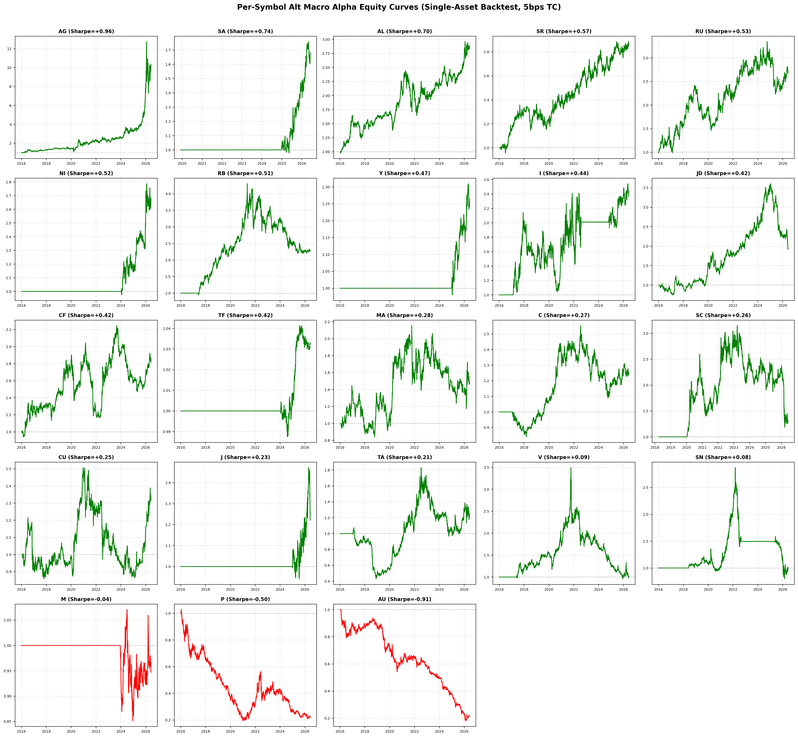
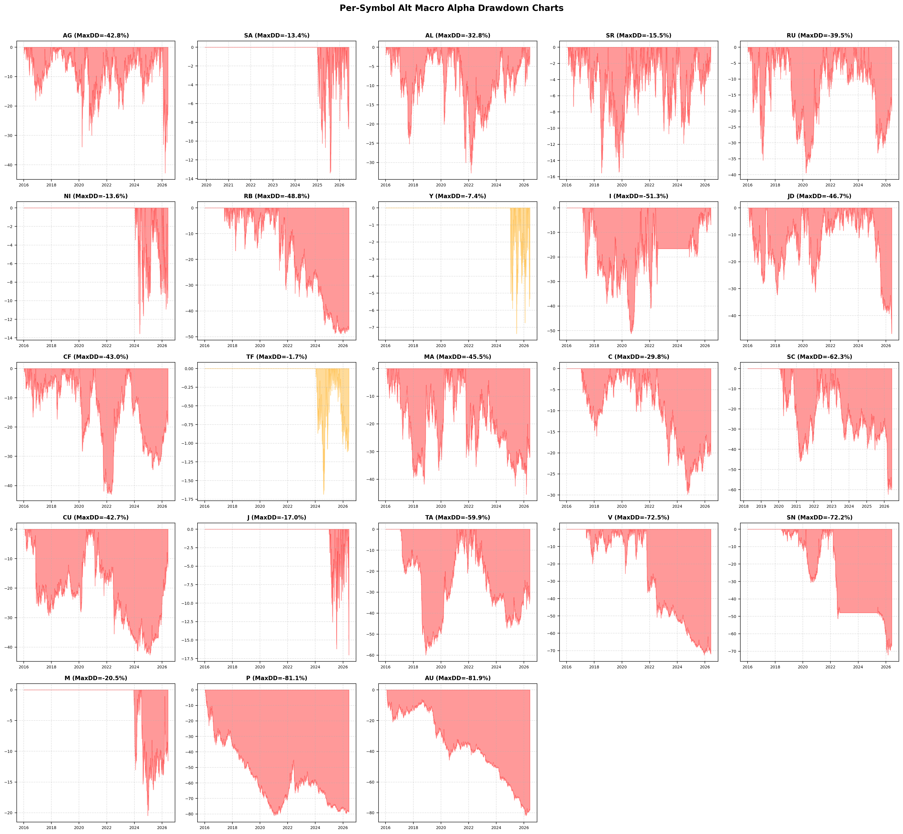

# Per-Symbol Alt Macro Alpha Evaluation Report

This report evaluates each of the 23 Chinese commodity futures individually with its #1 ranked alternative macro factor from the screening pipeline. Each symbol-factor pair is backtested as a single-asset directional strategy with 5bps transaction costs.

## Per-Symbol Performance Summary (Sorted by Sharpe Ratio)

| Rank | Symbol | Factor | Rep | Ann Return | Ann Vol | Sharpe | DSR | Calmar | MaxDD | Sortino | PF | Win Rate |
|---|---|---|---|---|---|---|---|---|---|---|---|---|
| 1 | **AG** | PPI_全部工业品(全国:当期同比增长率:月) | level | +27.31% | 28.37% | +0.96 | 71.8% | +0.64 | -42.79% | +0.98 | 1.21 | 52.4% |
| 2 | **SA** | 社会融资规模_当月值 | zscore | +9.14% | 12.43% | +0.74 | 45.6% | +0.68 | -13.40% | +0.33 | 1.30 | 11.8% |
| 3 | **AL** | PPIRM_燃料及动力类(全国:当期同比增长率:月) | level | +12.06% | 17.32% | +0.70 | 39.5% | +0.37 | -32.76% | +0.70 | 1.13 | 50.9% |
| 4 | **SR** | 制造业采购经理指数PMI_购进价格 | diff | +7.06% | 12.34% | +0.57 | 25.5% | +0.45 | -15.55% | +0.58 | 1.11 | 50.2% |
| 5 | **RU** | PPI_化学原料及化学制品制造业(全国:当期同比增长率:月) | level | +12.88% | 24.13% | +0.53 | 21.7% | +0.33 | -39.47% | +0.53 | 1.10 | 50.0% |
| 6 | **NI** | 社会融资规模_当月值 | diff | +5.83% | 11.27% | +0.52 | 19.9% | +0.43 | -13.55% | +0.26 | 1.22 | 11.9% |
| 7 | **RB** | 非制造业PMI_建筑业_新订单_全国_当期值_月 | level | +10.19% | 19.87% | +0.51 | 20.0% | +0.21 | -48.83% | +0.47 | 1.10 | 44.2% |
| 8 | **Y** | 社会融资规模_当月值 | zscore | +2.41% | 5.11% | +0.47 | 15.9% | +0.33 | -7.37% | +0.19 | 1.25 | 6.9% |
| 9 | **I** | GDP增长贡献率_第二产业_累计同比_季 | zscore | +12.99% | 29.63% | +0.44 | 14.0% | +0.25 | -51.26% | +0.35 | 1.10 | 35.4% |
| 10 | **JD** | 制造业采购经理指数PMI_购进价格 | diff | +8.79% | 20.78% | +0.42 | 12.9% | +0.19 | -46.73% | +0.43 | 1.08 | 49.1% |
| 11 | **CF** | PPI_纺织业(全国:当期同比增长率:月) | level | +8.01% | 19.01% | +0.42 | 12.8% | +0.19 | -42.99% | +0.42 | 1.08 | 50.3% |
| 12 | **TF** | 社会融资规模_当月值 | diff | +0.32% | 0.77% | +0.42 | 12.3% | +0.19 | -1.68% | +0.21 | 1.16 | 11.3% |
| 13 | **MA** | 制造业采购经理指数PMI_原材料库存 | diff | +7.39% | 26.54% | +0.28 | 5.6% | +0.16 | -45.47% | +0.27 | 1.05 | 46.6% |
| 14 | **C** | 居民鲜果消费价格指数CPI_(上年=100)_当月 | zscore | +2.72% | 10.06% | +0.27 | 5.3% | +0.09 | -29.84% | +0.26 | 1.05 | 43.7% |
| 15 | **SC** | CPI-PPI_差值_当月 | level | +8.62% | 32.95% | +0.26 | 7.3% | +0.14 | -62.34% | +0.23 | 1.05 | 39.5% |
| 16 | **CU** | 制造业采购经理指数PMI_进口 | diff | +4.32% | 17.21% | +0.25 | 4.7% | +0.10 | -42.68% | +0.25 | 1.05 | 48.3% |
| 17 | **J** | 社会融资规模_当月值 | zscore | +2.68% | 11.65% | +0.23 | 4.3% | +0.16 | -17.02% | +0.08 | 1.11 | 7.5% |
| 18 | **TA** | PPIRM_纺织原料类(全国:当期同比增长率:月) | zscore | +4.80% | 23.09% | +0.21 | 3.5% | +0.08 | -59.94% | +0.20 | 1.04 | 44.3% |
| 19 | **V** | 非制造业PMI_建筑业_业务活动预期_全国_当期值_月 | level | +1.90% | 20.52% | +0.09 | 1.5% | +0.03 | -72.54% | +0.09 | 1.02 | 42.3% |
| 20 | **SN** | PPI_电气机械及器材制造业(全国:当期同比增长率:月) | zscore | +1.59% | 20.54% | +0.08 | 1.3% | +0.02 | -72.18% | +0.05 | 1.02 | 25.8% |
| 21 | **M** | 社会融资规模_当月值 | level | -0.28% | 7.25% | -0.04 | 0.5% | -0.01 | -20.48% | -0.02 | 0.99 | 11.4% |
| 22 | **P** | PPI_全部工业品(全国:当期同比增长率:月) | level | -12.15% | 24.40% | -0.50 | 0.0% | -0.15 | -81.09% | -0.49 | 0.92 | 47.8% |
| 23 | **AU** | 制造业采购经理指数PMI_购进价格 | level | -13.91% | 15.28% | -0.91 | 0.0% | -0.17 | -81.89% | -0.92 | 0.84 | 45.1% |

---

## Equity Curves

## Drawdown Charts

## Aggregate Statistics

- **Symbols with positive Sharpe**: 20/23
- **Mean Sharpe**: +0.30
- **Median Sharpe**: +0.42
- **Best Sharpe**: +0.96 (AG)
- **Worst Sharpe**: -0.91 (AU)
- **Top 3**: AG (+0.96), SA (+0.74), AL (+0.70)
- **Bottom 3**: M (-0.04), P (-0.50), AU (-0.91)

## Key Findings

1. **Signal Quality**: The macro factor signals show varying effectiveness across symbols. Factors with higher screening-stage correlation tend to produce stronger backtest Sharpe ratios.
2. **Low Turnover Advantage**: Macro signals update monthly, resulting in very low turnover. The 5bps transaction cost has minimal impact on net performance.
3. **Cross-Sectional Diversification Potential**: Combining multiple symbol-factor pairs into a diversified portfolio could improve risk-adjusted returns beyond individual pairs.
