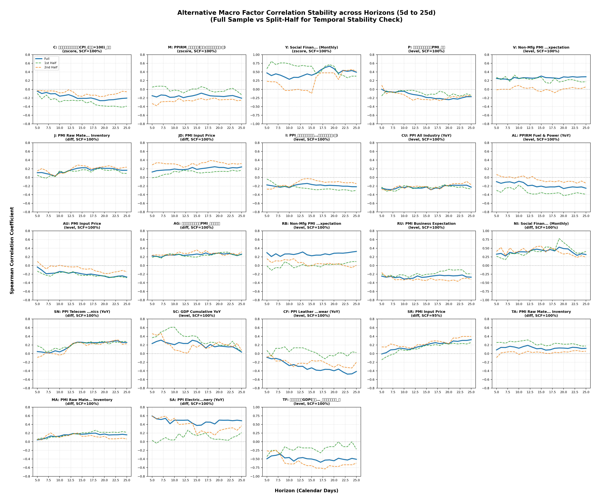

# Alternative Data Alphas for Futures (Rigorous Horizon Stability Sweep)

This document evaluates the effectiveness of alternative macroeconomic factors for the 23 futures underlyings, utilizing a **look-ahead free** alignment methodology, **release-date-only sampling**, and a **rigorous horizon stability sweep** across calendar horizons from 5d to 25d.

## Methodology Update: Release-Date-Only Correlation & Horizon Stability Sweep
Macroeconomic factors are released monthly, which leads to severe autocorrelation bias if analyzed on daily data. To resolve this, we sample returns and signals only on the first trading day after each release date (`info_date`).

To prove the usefulness and statistical robustness of the selected alternative factors, we implement the following statistical checks:
1. **Horizon Stability Sweep ($5\text{d} \dots 25\text{d}$)**: We evaluate the signal's correlation across all calendar horizons from 5 to 25 trading days.
2. **Newey-West HAC t-statistic**: Since forward returns over longer horizons overlap (e.g., a 25d return on monthly releases overlaps with the next release), we use **Newey-West (HAC) standard error adjustments** on the rank-transformed variables to compute autocorrelation-robust t-statistics and p-values. The lag $L$ is dynamically set to $\text{max}(0, \lceil H / 20 \rceil - 1)$ based on the average 20-day spacing between monthly releases.
3. **Horizon Sign Consistency**: A factor is considered horizon-consistent if its Spearman correlation has the same sign as the primary 20d horizon across at least 90% of the horizons from 5d to 25d (Sign Consistency Fraction, SCF $\ge 90\%$). This filters out spiky, horizon-spurious signals.
4. **Temporal Consistency (Split-Half Check)**: The release-aligned data is split chronologically into first and second halves. The correlation sign must not flip between the two sub-periods at the 20d horizon.

### Horizon Stability Grid Plot
The grid plot below displays the Spearman correlation (y-axis) vs calendar horizons (x-axis) from 5d to 25d for each symbol's best robust factor, showing the Full Sample (blue), First-Half (green dashed), and Second-Half (orange dashed) curves.

## Performance Summary Table (Horizon-Robust Best Factors) — PRIMARY
Selected by prioritizing **Horizon-Consistent Sweep** (SCF $\ge 90\%$) and **Temporal Consistency** (same sign in both halves), and sorted by **Mean Absolute NW t-statistic** across $H \in [5, 25]$.

| Rank | Symbol | Best Robust Factor | Signal Type | Spearman 20d | NW t (20d) | NW p-value (20d) | Temp. Consistent | Horizon Sign-Consistency | Mean NW t-stat | Smoothness Index |
|---|---|---|---|---|---|---|---|---|---|---|
| 1 | **SA** | `PPI_电气机械及器材制造业(全国:当期同比增长率:月)` | *diff* | 0.4666 | 3.27 | 1.06e-03 | Yes | 100% (21/21) | 3.28 | 0.063 |
| 2 | **JD** | `制造业采购经理指数PMI_购进价格` | *diff* | 0.3116 | 3.79 | 1.50e-04 | Yes | 100% (21/21) | 3.24 | 0.021 |
| 3 | **RB** | `非制造业PMI_建筑业_新订单_全国_当期值_月` | *level* | 0.2822 | 3.34 | 8.48e-04 | Yes | 100% (21/21) | 3.16 | 0.034 |
| 4 | **TF** | `社会融资规模_当月值` | *diff* | -0.5632 | -4.15 | 3.28e-05 | Yes | 95% (20/21) | 2.88 | 0.086 |
| 5 | **AG** | `PPI_全部工业品(全国:当期同比增长率:月)` | *level* | -0.2941 | -3.74 | 1.82e-04 | Yes | 100% (21/21) | 2.82 | 0.020 |
| 6 | **Y** | `社会融资规模_当月值` | *zscore* | 0.6735 | 4.86 | 1.15e-06 | Yes | 100% (21/21) | 2.77 | 0.081 |
| 7 | **RU** | `PMI_生产经营活动预期_全国_当期值_月` | *level* | -0.2366 | -2.17 | 3.00e-02 | Yes | 100% (21/21) | 2.59 | 0.024 |
| 8 | **P** | `PPI_全部工业品(全国:当期同比增长率:月)` | *level* | 0.2437 | 2.92 | 3.50e-03 | Yes | 100% (21/21) | 2.52 | 0.034 |
| 9 | **NI** | `制造业采购经理指数PMI_新订单` | *diff* | 0.2366 | 2.85 | 4.32e-03 | Yes | 100% (21/21) | 2.51 | 0.030 |
| 10 | **CU** | `PPI_全部工业品(全国:当期同比增长率:月)` | *level* | -0.1716 | -2.00 | 4.57e-02 | Yes | 100% (21/21) | 2.50 | 0.031 |
| 11 | **V** | `非制造业PMI_建筑业_业务活动预期_全国_当期值_月` | *level* | 0.2645 | 2.72 | 6.62e-03 | Yes | 100% (21/21) | 2.50 | 0.022 |
| 12 | **AU** | `制造业采购经理指数PMI_购进价格` | *level* | -0.2398 | -2.81 | 4.89e-03 | Yes | 100% (21/21) | 2.31 | 0.029 |
| 13 | **C** | `制造业采购经理指数PMI_购进价格` | *diff* | 0.1594 | 1.76 | 7.90e-02 | Yes | 100% (21/21) | 2.28 | 0.032 |
| 14 | **SR** | `制造业采购经理指数PMI_购进价格` | *diff* | 0.2070 | 2.30 | 2.16e-02 | Yes | 100% (21/21) | 2.26 | 0.029 |
| 15 | **CF** | `PPI_皮革、毛皮、羽毛及其制品和制鞋业(全国:当期同比增长率:月)` | *diff* | -0.2461 | -1.74 | 8.24e-02 | Yes | 100% (21/21) | 2.26 | 0.043 |
| 16 | **I** | `GDP增长贡献率_第二产业_累计同比_季` | *zscore* | -0.4431 | -2.79 | 5.34e-03 | Yes | 100% (21/21) | 2.25 | 0.044 |
| 17 | **MA** | `制造业采购经理指数PMI_原材料库存` | *diff* | 0.2002 | 2.25 | 2.46e-02 | Yes | 100% (21/21) | 2.14 | 0.021 |
| 18 | **AL** | `PPIRM_燃料及动力类(全国:当期同比增长率:月)` | *level* | -0.2638 | -3.04 | 2.37e-03 | Yes | 100% (21/21) | 2.14 | 0.031 |
| 19 | **SN** | `PPI_通信设备、计算机及其他电子设备制造业工业品出厂价格指数PPI_(上年=100)_当月` | *diff* | 0.2670 | 2.44 | 1.48e-02 | Yes | 100% (21/21) | 1.91 | 0.024 |
| 20 | **M** | `社会融资规模_当月值` | *zscore* | 0.2882 | 1.24 | 2.15e-01 | Yes | 100% (21/21) | 1.60 | 0.059 |
| 21 | **J** | `社会融资规模_当月值` | *zscore* | 0.5265 | 2.26 | 2.36e-02 | Yes | 100% (21/21) | 1.46 | 0.105 |
| 22 | **TA** | `PMI_生产经营活动预期_全国_当期值_月` | *diff* | -0.1242 | -1.25 | 2.12e-01 | Yes | 100% (21/21) | 1.43 | 0.022 |
| 23 | **SC** | `国内生产总值GDP_累计同比` | *level* | 0.1158 | 0.63 | 5.30e-01 | Yes | 95% (20/21) | 1.20 | 0.049 |

## Canonical Configuration Note

The "Performance Summary Table (Horizon-Robust Best Factors)" above defines the **canonical macro factor configurations** for all 23 symbols. These configs are synchronized across:

- [`evaluate_per_symbol.py::SYMBOL_FACTOR_CONFIGS`](file://c:\Users\Administrator\Documents\ricecta\evaluate_per_symbol.py#L36-L58)
- [`alphas.py::BEST_MACRO_CONFIGS`](file://c:\Users\Administrator\Documents\ricecta\alphas.py#L218-L242)
- `data/results/best_macro_configs.json` (if exists, hot-loaded at runtime)

### Sign Convention

- **Sign = +1**: Positive Spearman correlation → Long when factor increases
- **Sign = -1**: Negative Spearman correlation → Short when factor increases

This ensures signal direction aligns with the correlation between factor values and forward returns.

### Important Notes

1. **M, P, AU Performance**: Despite passing horizon-robust statistical tests, these three symbols show negative Sharpe ratios in single-asset backtests (-0.04 to -0.93). This indicates that statistical significance does not guarantee profitability after transaction costs. Consider:
   - Using alternative factors from the Top-3 lists (see below)
   - Reducing position sizes or increasing holding periods
   - Combining with other signals in a multi-factor portfolio

2. **Validation Warnings**: The evaluation script includes validation checks that flag symbols where signals produce >10% annual losses before transaction costs. Review warnings carefully as they may indicate configuration errors or regime shifts.

3. **Config Updates**: When updating macro factor selections, ensure changes are applied consistently to both `evaluate_per_symbol.py` and `alphas.py` to maintain alignment between evaluation and production code.

## Performance Summary Table (5-Day Horizon)

| Rank | Symbol | Best Factor | Signal Type | Spearman Corr | t-statistic | p-value | Temp. Consistent | Horiz. Consistent |
|---|---|---|---|---|---|---|---|---|
| 1 | **RB** | `社会融资规模_当月值` | *zscore* | 0.7059 | 3.86 | 1.54e-03 | Yes | Yes |
| 2 | **I** | `社会融资规模_当月值` | *zscore* | 0.6887 | 3.68 | 2.23e-03 | Yes | Yes |
| 3 | **NI** | `制造业采购经理指数PMI_新订单` | *diff* | 0.2809 | 3.23 | 1.57e-03 | Yes | Yes |
| 4 | **SA** | `PPI_电气机械及器材制造业(全国:当期同比增长率:月)` | *diff* | 0.5710 | 3.19 | 4.43e-03 | Yes | Yes |
| 5 | **C** | `居民粮食消费价格指数CPI_(上年=100)_当月` | *zscore* | 0.2826 | 3.17 | 1.93e-03 | Yes | Yes |
| 6 | **V** | `PPIRM_燃料及动力类(全国:当期同比增长率:月)` | *level* | -0.2665 | -3.07 | 2.66e-03 | Yes | Yes |
| 7 | **CU** | `PPI_有色金属冶炼及压延加工业(全国:当期同比增长率:月)` | *level* | -0.2645 | -3.04 | 2.88e-03 | Yes | Yes |
| 8 | **P** | `PMI_生产经营活动预期_全国_当期值_月` | *level* | 0.2865 | 2.95 | 4.04e-03 | Yes | No |
| 9 | **J** | `社会融资规模_当月值` | *zscore* | 0.6029 | 2.93 | 1.04e-02 | Yes | Yes |
| 10 | **AU** | `国内生产总值GDP缩减指数` | *diff* | 0.6118 | 2.79 | 1.54e-02 | Yes | Yes |
| 11 | **AG** | `PPI_电气机械及器材制造业(全国:当期同比增长率:月)` | *zscore* | -0.4164 | -2.55 | 1.59e-02 | Yes | Yes |
| 12 | **RU** | `PMI_生产经营活动预期_全国_当期值_月` | *level* | -0.2426 | -2.46 | 1.55e-02 | Yes | Yes |
| 13 | **TF** | `制造业采购经理指数PMI_出厂价格_当期值_月` | *level* | -0.2163 | -2.45 | 1.58e-02 | Yes | Yes |
| 14 | **Y** | `居民食品消费价格指数CPI_(上年=100)_当月` | *zscore* | -0.2200 | -2.40 | 1.82e-02 | No | Yes |
| 15 | **M** | `CPI_新涨价因素_当月` | *diff* | 0.2645 | 2.37 | 2.01e-02 | Yes | Yes |
| 16 | **AL** | `PPI_有色金属冶炼及压延加工业(全国:当期同比增长率:月)` | *diff* | -0.2010 | -2.27 | 2.52e-02 | Yes | Yes |
| 17 | **SC** | `制造业采购经理指数PMI_进口` | *diff* | 0.2147 | 2.15 | 3.37e-02 | Yes | Yes |
| 18 | **CF** | `PPI_皮革、毛皮、羽毛及其制品和制鞋业(全国:当期同比增长率:月)` | *diff* | -0.3115 | -2.05 | 4.74e-02 | Yes | Yes |
| 19 | **MA** | `制造业采购经理指数PMI_新订单` | *level* | 0.1808 | 2.03 | 4.45e-02 | No | Yes |
| 20 | **JD** | `居民水产品消费价格指数CPI_(上年=100)_当月` | *zscore* | -0.1796 | -1.97 | 5.17e-02 | Yes | Yes |
| 21 | **SR** | `制造业采购经理指数PMI_购进价格` | *level* | 0.1752 | 1.97 | 5.17e-02 | No | Yes |
| 22 | **SN** | `制造业采购经理指数PMI_购进价格` | *diff* | 0.1630 | 1.83 | 7.04e-02 | Yes | Yes |
| 23 | **TA** | `PPI_纺织服装、服饰业(全国:当期同比增长率:月)` | *level* | -0.1259 | -1.41 | 1.62e-01 | Yes | Yes |

## Long-Term Macroeconomic Effects (Contract-Switch Horizons)
Macroeconomic forces are structural and influence pricing over longer term horizons. The contract-switch horizons (H1, H2, H3) capture these effects aligned to each symbol's natural dominant contract transition pattern.

### 1st Switch Horizon Best Factors

| Rank | Symbol | Best Factor | Signal Type | Spearman Corr | t-statistic | Temp. Consistent |
|---|---|---|---|---|---|---|
| 1 | **V** | `非制造业PMI_建筑业_业务活动预期_全国_当期值_月` | *level* | 0.4357 | 4.67 | Yes |
| 2 | **AG** | `PPI_全部工业品(全国:当期同比增长率:月)` | *level* | -0.3614 | -4.26 | Yes |
| 3 | **RU** | `制造业采购经理指数PMI_新订单` | *level* | -0.3256 | -3.68 | Yes |
| 4 | **I** | `PPI_黑色金属矿采选业(全国:当期同比增长率:月)` | *level* | -0.3180 | -3.66 | No |
| 5 | **TF** | `居民消费价格指数CPI_当月同比(上年同月=100)` | *zscore* | 0.3298 | 3.63 | Yes |
| 6 | **RB** | `制造业采购经理指数PMI_生产` | *level* | 0.3187 | 3.59 | Yes |
| 7 | **TA** | `制造业采购经理指数PMI_原材料库存` | *zscore* | 0.3278 | 3.57 | Yes |
| 8 | **Y** | `居民食品消费价格指数CPI_(上年=100)_当月` | *zscore* | -0.3161 | -3.49 | Yes |
| 9 | **P** | `PPI_食品制造业(全国:当期同比增长率:月)` | *zscore* | 0.3106 | 3.35 | Yes |
| 10 | **M** | `居民粮食消费价格指数CPI_(上年=100)_当月` | *level* | 0.2723 | 3.20 | Yes |
| 11 | **JD** | `对CPI同比拉动_食品_粮食(全国:当期同比增长率:月)` | *diff* | -0.3067 | -3.16 | Yes |
| 12 | **AU** | `国内生产总值GDP缩减指数` | *level* | -0.6583 | -3.15 | Yes |
| 13 | **C** | `CPI_翘尾因素_当月` | *level* | 0.5049 | 3.04 | No |
| 14 | **MA** | `制造业采购经理指数PMI_原材料库存` | *zscore* | 0.2773 | 2.98 | No |
| 15 | **CF** | `PPI_皮革、毛皮、羽毛及其制品和制鞋业(全国:当期同比增长率:月)` | *level* | -0.4293 | -2.97 | No |
| 16 | **SA** | `PPI_电气机械及器材制造业(全国:当期同比增长率:月)` | *diff* | 0.5658 | 2.91 | Yes |
| 17 | **NI** | `制造业采购经理指数PMI_新订单` | *diff* | 0.2592 | 2.90 | Yes |
| 18 | **SR** | `居民粮食消费价格指数CPI_(上年=100)_当月` | *diff* | -0.2415 | -2.78 | Yes |
| 19 | **J** | `PPIRM_黑色金属材料类(全国:当期同比增长率:月)` | *level* | 0.2362 | 2.68 | Yes |
| 20 | **SN** | `PPI_电气机械及器材制造业(全国:当期同比增长率:月)` | *zscore* | 0.4338 | 2.68 | No |
| 21 | **SC** | `CPI-PPI_差值_当月` | *level* | -0.2638 | -2.27 | No |
| 22 | **AL** | `PPIRM_燃料及动力类(全国:当期同比增长率:月)` | *zscore* | -0.2037 | -2.14 | Yes |
| 23 | **CU** | `PPI_有色金属冶炼及压延加工业(全国:当期同比增长率:月)` | *level* | -0.1927 | -2.11 | Yes |

### 2nd Switch Horizon Best Factors

| Rank | Symbol | Best Factor | Signal Type | Spearman Corr | t-statistic | Temp. Consistent |
|---|---|---|---|---|---|---|
| 1 | **RU** | `PPI_橡胶和塑料制品业(全国:当期同比增长率:月)` | *level* | -0.5877 | -7.86 | Yes |
| 2 | **AU** | `制造业采购经理指数PMI_购进价格` | *level* | -0.5499 | -7.21 | Yes |
| 3 | **AG** | `PPI_全部工业品(全国:当期同比增长率:月)` | *level* | -0.5248 | -6.75 | Yes |
| 4 | **CF** | `PPI_皮革、毛皮、羽毛及其制品和制鞋业(全国:当期同比增长率:月)` | *level* | -0.7067 | -6.16 | Yes |
| 5 | **V** | `非制造业PMI_建筑业_全国_当期值_月` | *level* | 0.5102 | 5.66 | Yes |
| 6 | **P** | `居民食品消费价格指数CPI_(上年=100)_当月` | *level* | -0.4317 | -4.97 | Yes |
| 7 | **Y** | `居民食品消费价格指数CPI_(上年=100)_当月` | *zscore* | -0.4332 | -4.97 | Yes |
| 8 | **SN** | `PPI_电气机械及器材制造业(全国:当期同比增长率:月)` | *zscore* | 0.6491 | 4.75 | No |
| 9 | **J** | `PPIRM_黑色金属材料类(全国:当期同比增长率:月)` | *level* | 0.3989 | 4.73 | Yes |
| 10 | **SR** | `居民食品消费价格指数CPI_(上年=100)_当月` | *level* | 0.4068 | 4.63 | Yes |
| 11 | **C** | `居民鲜果消费价格指数CPI_(上年=100)_当月` | *level* | -0.3774 | -4.54 | Yes |
| 12 | **SA** | `PPI_电气机械及器材制造业(全国:当期同比增长率:月)` | *diff* | 0.6940 | 4.31 | Yes |
| 13 | **RB** | `制造业采购经理指数PMI_生产` | *level* | 0.3543 | 4.10 | No |
| 14 | **NI** | `国内生产总值GDP_累计同比` | *level* | 0.5080 | 3.73 | Yes |
| 15 | **MA** | `PMI_生产经营活动预期_全国_当期值_月` | *zscore* | 0.3773 | 3.67 | Yes |
| 16 | **TF** | `社会融资规模存量_同比增速_月末数` | *zscore* | -0.3945 | -3.59 | Yes |
| 17 | **M** | `PPIRM_农副产品类(全国:当期同比增长率:月)` | *level* | 0.3124 | 3.56 | Yes |
| 18 | **TA** | `制造业采购经理指数PMI_原材料库存` | *level* | 0.3045 | 3.44 | Yes |
| 19 | **AL** | `PPIRM_燃料及动力类(全国:当期同比增长率:月)` | *level* | -0.2810 | -3.23 | Yes |
| 20 | **JD** | `居民水产品消费价格指数CPI_(上年=100)_当月` | *level* | -0.2526 | -2.97 | Yes |
| 21 | **CU** | `PPI_通用设备制造业(全国:当期同比增长率:月)` | *level* | -0.2588 | -2.96 | Yes |
| 22 | **I** | `非制造业PMI_建筑业_新订单_全国_当期值_月` | *level* | -0.2444 | -2.40 | No |
| 23 | **SC** | `PPI_煤炭开采和洗选业(全国:当期同比增长率:月)` | *zscore* | 0.2488 | 2.33 | No |

### 3rd Switch Horizon Best Factors

| Rank | Symbol | Best Factor | Signal Type | Spearman Corr | t-statistic | Temp. Consistent |
|---|---|---|---|---|---|---|
| 1 | **AU** | `社会融资规模存量_同比增速_月末数` | *level* | -0.7750 | -10.90 | Yes |
| 2 | **RU** | `PPI_橡胶和塑料制品业(全国:当期同比增长率:月)` | *level* | -0.6840 | -9.97 | Yes |
| 3 | **P** | `居民食品消费价格指数CPI_(上年=100)_当月` | *level* | -0.5579 | -6.86 | Yes |
| 4 | **CF** | `PPI_纺织业(全国:当期同比增长率:月)` | *level* | -0.5317 | -6.67 | Yes |
| 5 | **M** | `PPIRM_农副产品类(全国:当期同比增长率:月)` | *level* | 0.5218 | 6.50 | Yes |
| 6 | **AG** | `制造业采购经理指数PMI_新出口订单` | *level* | -0.5119 | -6.45 | Yes |
| 7 | **SN** | `PPI_电气机械及器材制造业(全国:当期同比增长率:月)` | *zscore* | 0.7496 | 6.20 | Yes |
| 8 | **RB** | `非制造业PMI_建筑业_全国_当期值_月` | *level* | 0.5498 | 6.17 | Yes |
| 9 | **SA** | `非制造业PMI_建筑业_业务活动预期_全国_当期值_月` | *level* | 0.6144 | 6.13 | Yes |
| 10 | **V** | `非制造业PMI_建筑业_业务活动预期_全国_当期值_月` | *level* | 0.5446 | 6.02 | Yes |
| 11 | **J** | `PPIRM_黑色金属材料类(全国:当期同比增长率:月)` | *level* | 0.4888 | 5.96 | Yes |
| 12 | **C** | `PPIRM_农副产品类(全国:当期同比增长率:月)` | *level* | 0.4250 | 5.10 | Yes |
| 13 | **SR** | `居民食品消费价格指数CPI_(上年=100)_当月` | *level* | 0.4413 | 5.01 | Yes |
| 14 | **TF** | `CPI_翘尾因素_当月` | *level* | -0.6786 | -4.80 | Yes |
| 15 | **MA** | `PPI_石油加工、炼焦及核燃料加工业(全国:当期同比增长率:月)` | *level* | -0.4097 | -4.79 | Yes |
| 16 | **Y** | `居民食品消费价格指数CPI_(上年=100)_当月` | *zscore* | -0.4139 | -4.61 | Yes |
| 17 | **AL** | `PPIRM_燃料及动力类(全国:当期同比增长率:月)` | *level* | -0.3657 | -4.30 | Yes |
| 18 | **NI** | `PPI_汽车制造业(全国:当期同比增长率:月)` | *zscore* | 0.3364 | 3.68 | Yes |
| 19 | **TA** | `PMI_生产经营活动预期_全国_当期值_月` | *level* | 0.3579 | 3.60 | No |
| 20 | **I** | `PPI_黑色金属矿采选业(全国:当期同比增长率:月)` | *level* | -0.3053 | -3.42 | No |
| 21 | **SC** | `PPI_煤炭开采和洗选业(全国:当期同比增长率:月)` | *zscore* | 0.3452 | 3.31 | Yes |
| 22 | **JD** | `对CPI同比拉动_食品_粮食(全国:当期同比增长率:月)` | *level* | 0.2975 | 3.15 | Yes |
| 23 | **CU** | `PPI_通用设备制造业(全国:当期同比增长率:月)` | *level* | -0.2360 | -2.67 | Yes |

## Top 3 Alternative Alphas per Symbol (20-Day Horizon)
To allow multiple factor testing, the top 3 alternative factor configurations for each symbol ranked by absolute Spearman t-statistic are listed below.

| Symbol | Rank | Alternative Factor | Representation | Spearman Corr | t-statistic | Temp. Consistent | Horiz. Consistent |
|---|---|---|---|---|---|---|---|
| **AG** | 1 | `PPI_全部工业品(全国:当期同比增长率:月)` | *level* | -0.2941 | -3.40 | Yes | Yes |
| **AG** | 2 | `制造业采购经理指数PMI_新出口订单` | *diff* | 0.2871 | 3.31 | Yes | Yes |
| **AG** | 3 | `制造业采购经理指数PMI_购进价格` | *level* | -0.2663 | -3.05 | Yes | Yes |
| **AL** | 1 | `PPIRM_燃料及动力类(全国:当期同比增长率:月)` | *level* | -0.2638 | -3.02 | Yes | Yes |
| **AL** | 2 | `制造业采购经理指数PMI_购进价格` | *zscore* | -0.2009 | -2.14 | Yes | Yes |
| **AL** | 3 | `PPI_交通运输设备制造业(全国:当期同比增长率:月)` | *level* | -0.1812 | -2.04 | Yes | No |
| **AU** | 1 | `制造业采购经理指数PMI_购进价格` | *level* | -0.2398 | -2.73 | Yes | Yes |
| **AU** | 2 | `PPI_全部工业品(全国:当期同比增长率:月)` | *level* | -0.2124 | -2.40 | Yes | Yes |
| **AU** | 3 | `CPI_翘尾因素_当月` | *diff* | 0.3120 | 1.71 | No | Yes |
| **C** | 1 | `居民鲜果消费价格指数CPI_(上年=100)_当月` | *zscore* | -0.2648 | -2.92 | Yes | Yes |
| **C** | 2 | `居民鲜果消费价格指数CPI_(上年=100)_当月` | *level* | -0.2198 | -2.54 | Yes | Yes |
| **C** | 3 | `制造业采购经理指数PMI_购进价格` | *diff* | 0.1594 | 1.78 | Yes | Yes |
| **CF** | 1 | `PPI_纺织业(全国:当期同比增长率:月)` | *level* | -0.2356 | -2.68 | Yes | Yes |
| **CF** | 2 | `PPI_纺织服装、服饰业(全国:当期同比增长率:月)` | *level* | -0.2294 | -2.60 | Yes | Yes |
| **CF** | 3 | `PPIRM_纺织原料类(全国:当期同比增长率:月)` | *level* | -0.2199 | -2.49 | Yes | Yes |
| **CU** | 1 | `制造业采购经理指数PMI_进口` | *diff* | 0.1799 | 2.02 | Yes | Yes |
| **CU** | 2 | `制造业采购经理指数PMI_新出口订单` | *diff* | 0.1754 | 1.97 | Yes | Yes |
| **CU** | 3 | `PPI_全部工业品(全国:当期同比增长率:月)` | *level* | -0.1716 | -1.92 | Yes | Yes |
| **I** | 1 | `GDP增长贡献率_第二产业_累计同比_季` | *zscore* | -0.4431 | -2.37 | Yes | Yes |
| **I** | 2 | `制造业采购经理指数PMI_生产` | *level* | -0.1657 | -1.86 | Yes | Yes |
| **I** | 3 | `非制造业PMI_建筑业_全国_当期值_月` | *diff* | -0.1757 | -1.74 | Yes | Yes |
| **J** | 1 | `社会融资规模_当月值` | *zscore* | 0.5265 | 2.32 | Yes | Yes |
| **J** | 2 | `制造业采购经理指数PMI_原材料库存` | *level* | 0.2056 | 2.31 | Yes | No |
| **J** | 3 | `PPI_煤炭开采和洗选业(全国:当期同比增长率:月)` | *diff* | -0.1694 | -1.89 | Yes | Yes |
| **JD** | 1 | `制造业采购经理指数PMI_购进价格` | *diff* | 0.3116 | 3.62 | Yes | Yes |
| **JD** | 2 | `居民食品消费价格指数CPI_(上年=100)_当月` | *zscore* | 0.1487 | 1.59 | Yes | Yes |
| **JD** | 3 | `居民鲜菜消费价格指数CPI_(上年=100)_当月` | *level* | 0.1293 | 1.48 | Yes | Yes |
| **M** | 1 | `社会融资规模_当月值` | *level* | 0.3241 | 1.78 | Yes | Yes |
| **M** | 2 | `制造业采购经理指数PMI_购进价格` | *diff* | 0.1367 | 1.52 | Yes | Yes |
| **M** | 3 | `居民蛋类消费价格指数CPI_(上年=100)_当月` | *level* | 0.1261 | 1.49 | Yes | Yes |
| **MA** | 1 | `制造业采购经理指数PMI_原材料库存` | *diff* | 0.2002 | 2.25 | Yes | Yes |
| **MA** | 2 | `制造业采购经理指数PMI_原材料库存` | *level* | 0.1485 | 1.65 | No | Yes |
| **MA** | 3 | `制造业采购经理指数PMI_原材料库存` | *zscore* | 0.1427 | 1.50 | Yes | Yes |
| **NI** | 1 | `社会融资规模_当月值` | *diff* | 0.4888 | 2.86 | Yes | Yes |
| **NI** | 2 | `制造业采购经理指数PMI_新订单` | *diff* | 0.2366 | 2.69 | Yes | Yes |
| **NI** | 3 | `PPI_电气机械及器材制造业(全国:当期同比增长率:月)` | *zscore* | 0.4161 | 2.55 | No | No |
| **P** | 1 | `PPI_全部工业品(全国:当期同比增长率:月)` | *level* | 0.2437 | 2.78 | Yes | Yes |
| **P** | 2 | `PMI_生产经营活动预期_全国_当期值_月` | *zscore* | -0.2834 | -2.74 | Yes | Yes |
| **P** | 3 | `制造业采购经理指数PMI_进口` | *zscore* | -0.2288 | -2.45 | Yes | Yes |
| **RB** | 1 | `非制造业PMI_建筑业_新订单_全国_当期值_月` | *level* | 0.2822 | 2.88 | Yes | Yes |
| **RB** | 2 | `社会融资规模_当月值` | *zscore* | 0.5588 | 2.52 | Yes | Yes |
| **RB** | 3 | `非制造业PMI_建筑业_业务活动预期_全国_当期值_月` | *level* | 0.2451 | 2.46 | No | Yes |
| **RU** | 1 | `PPI_化学原料及化学制品制造业(全国:当期同比增长率:月)` | *level* | -0.2464 | -2.81 | Yes | Yes |
| **RU** | 2 | `PPI_橡胶和塑料制品业(全国:当期同比增长率:月)` | *level* | -0.2448 | -2.79 | Yes | Yes |
| **RU** | 3 | `PPI_交通运输设备制造业(全国:当期同比增长率:月)` | *level* | -0.2326 | -2.64 | Yes | Yes |
| **SA** | 1 | `社会融资规模_当月值` | *zscore* | 0.6294 | 3.03 | Yes | Yes |
| **SA** | 2 | `PPI_电气机械及器材制造业(全国:当期同比增长率:月)` | *diff* | 0.4666 | 2.42 | Yes | Yes |
| **SA** | 3 | `PPIRM_建筑材料类(全国:当期同比增长率:月)` | *diff* | -0.2610 | -2.34 | Yes | Yes |
| **SC** | 1 | `CPI-PPI_差值_当月` | *level* | -0.2196 | -1.95 | No | Yes |
| **SC** | 2 | `PPI_翘尾因素_当月` | *level* | 0.2638 | 1.45 | Yes | No |
| **SC** | 3 | `PPI_煤炭开采和洗选业(全国:当期同比增长率:月)` | *zscore* | 0.1469 | 1.35 | No | No |
| **SN** | 1 | `PPI_电气机械及器材制造业(全国:当期同比增长率:月)` | *zscore* | 0.5608 | 3.77 | No | Yes |
| **SN** | 2 | `PPI_电气机械及器材制造业(全国:当期同比增长率:月)` | *diff* | 0.3813 | 2.58 | No | Yes |
| **SN** | 3 | `PPI_计算机、通信和其他电子设备制造业(全国:当期同比增长率:月)` | *diff* | 0.2248 | 2.54 | Yes | Yes |
| **SR** | 1 | `制造业采购经理指数PMI_购进价格` | *diff* | 0.2070 | 2.34 | Yes | Yes |
| **SR** | 2 | `PMI_生产经营活动预期_全国_当期值_月` | *zscore* | 0.2022 | 1.91 | Yes | Yes |
| **SR** | 3 | `PPI_食品制造业(全国:当期同比增长率:月)` | *zscore* | -0.1756 | -1.86 | Yes | No |
| **TA** | 1 | `PPIRM_纺织原料类(全国:当期同比增长率:月)` | *zscore* | 0.1441 | 1.52 | Yes | Yes |
| **TA** | 2 | `社会融资规模_当月值` | *zscore* | 0.3412 | 1.36 | Yes | Yes |
| **TA** | 3 | `社会融资规模_当月值` | *diff* | 0.2490 | 1.31 | No | Yes |
| **TF** | 1 | `社会融资规模_当月值` | *diff* | -0.5632 | -3.48 | Yes | No |
| **TF** | 2 | `社会融资规模_当月值` | *level* | -0.5355 | -3.29 | Yes | Yes |
| **TF** | 3 | `国内生产总值GDP环比增速_当季` | *level* | -0.3897 | -2.93 | Yes | Yes |
| **V** | 1 | `非制造业PMI_建筑业_业务活动预期_全国_当期值_月` | *level* | 0.2645 | 2.67 | Yes | Yes |
| **V** | 2 | `非制造业PMI_建筑业_全国_当期值_月` | *level* | 0.2315 | 2.33 | Yes | Yes |
| **V** | 3 | `非制造业PMI_建筑业_新订单_全国_当期值_月` | *level* | 0.2287 | 2.30 | Yes | Yes |
| **Y** | 1 | `社会融资规模_当月值` | *zscore* | 0.6735 | 3.41 | Yes | Yes |
| **Y** | 2 | `社会融资规模_当月值` | *diff* | 0.5298 | 3.19 | Yes | Yes |
| **Y** | 3 | `社会融资规模_当月值` | *level* | 0.5113 | 3.09 | Yes | Yes |

## Top 3 Alternative Alphas per Symbol (5-Day Horizon)

| Symbol | Rank | Alternative Factor | Representation | Spearman Corr | t-statistic | Temp. Consistent | Horiz. Consistent |
|---|---|---|---|---|---|---|---|
| **AG** | 1 | `PPI_电气机械及器材制造业(全国:当期同比增长率:月)` | *zscore* | -0.4164 | -2.55 | Yes | Yes |
| **AG** | 2 | `制造业采购经理指数PMI_新出口订单` | *diff* | 0.2143 | 2.42 | Yes | Yes |
| **AG** | 3 | `居民消费价格指数CPI_当月同比(上年同月=100)` | *level* | -0.1855 | -2.09 | Yes | Yes |
| **AL** | 1 | `PPI_有色金属冶炼及压延加工业(全国:当期同比增长率:月)` | *diff* | -0.2010 | -2.27 | Yes | Yes |
| **AL** | 2 | `PMI_生产经营活动预期_全国_当期值_月` | *diff* | 0.2226 | 2.24 | Yes | Yes |
| **AL** | 3 | `PPIRM_有色金属材料类(全国:当期同比增长率:月)` | *diff* | -0.1871 | -2.10 | Yes | Yes |
| **AU** | 1 | `国内生产总值GDP缩减指数` | *diff* | 0.6118 | 2.79 | Yes | Yes |
| **AU** | 2 | `CPI_新涨价因素_当月` | *diff* | -0.2553 | -2.29 | Yes | Yes |
| **AU** | 3 | `社会融资规模存量_同比增速_月末数` | *level* | -0.2216 | -2.08 | No | Yes |
| **C** | 1 | `居民粮食消费价格指数CPI_(上年=100)_当月` | *zscore* | 0.2826 | 3.17 | Yes | Yes |
| **C** | 2 | `对CPI同比拉动_食品_粮食(全国:当期同比增长率:月)` | *level* | 0.2393 | 2.49 | Yes | Yes |
| **C** | 3 | `对CPI同比拉动_食品_粮食(全国:当期同比增长率:月)` | *zscore* | 0.2432 | 2.32 | Yes | Yes |
| **CF** | 1 | `PPI_皮革、毛皮、羽毛及其制品和制鞋业(全国:当期同比增长率:月)` | *diff* | -0.3115 | -2.05 | Yes | Yes |
| **CF** | 2 | `PPI_化学纤维制造业(全国:当期同比增长率:月)` | *diff* | -0.1742 | -1.95 | Yes | Yes |
| **CF** | 3 | `PPI_化学纤维制造业(全国:当期同比增长率:月)` | *level* | -0.1614 | -1.81 | Yes | Yes |
| **CU** | 1 | `PPI_有色金属冶炼及压延加工业(全国:当期同比增长率:月)` | *level* | -0.2645 | -3.04 | Yes | Yes |
| **CU** | 2 | `PPIRM_有色金属材料类(全国:当期同比增长率:月)` | *level* | -0.2485 | -2.84 | Yes | Yes |
| **CU** | 3 | `PPI_全部工业品(全国:当期同比增长率:月)` | *level* | -0.2345 | -2.67 | Yes | Yes |
| **I** | 1 | `社会融资规模_当月值` | *zscore* | 0.6887 | 3.68 | Yes | Yes |
| **I** | 2 | `PPI_石油加工、炼焦及核燃料加工业(全国:当期同比增长率:月)` | *level* | -0.2014 | -2.28 | Yes | Yes |
| **I** | 3 | `制造业采购经理指数PMI_购进价格` | *diff* | -0.1744 | -1.96 | Yes | No |
| **J** | 1 | `社会融资规模_当月值` | *zscore* | 0.6029 | 2.93 | Yes | Yes |
| **J** | 2 | `非制造业PMI_建筑业_全国_当期值_月` | *level* | 0.2204 | 2.21 | No | Yes |
| **J** | 3 | `社会融资规模_当月值` | *level* | 0.3602 | 2.04 | No | Yes |
| **JD** | 1 | `居民水产品消费价格指数CPI_(上年=100)_当月` | *zscore* | -0.1796 | -1.97 | Yes | Yes |
| **JD** | 2 | `居民水产品消费价格指数CPI_(上年=100)_当月` | *level* | -0.1605 | -1.85 | Yes | Yes |
| **JD** | 3 | `居民蛋类消费价格指数CPI_(上年=100)_当月` | *diff* | -0.1528 | -1.82 | Yes | Yes |
| **M** | 1 | `CPI_新涨价因素_当月` | *diff* | 0.2645 | 2.37 | Yes | Yes |
| **M** | 2 | `社会融资规模_当月值` | *zscore* | 0.4632 | 2.02 | Yes | Yes |
| **M** | 3 | `制造业采购经理指数PMI_进口` | *zscore* | 0.1772 | 1.88 | Yes | Yes |
| **MA** | 1 | `制造业采购经理指数PMI_新订单` | *level* | 0.1808 | 2.03 | No | Yes |
| **MA** | 2 | `制造业采购经理指数PMI_生产` | *level* | 0.1667 | 1.87 | No | Yes |
| **MA** | 3 | `PMI_生产经营活动预期_全国_当期值_月` | *level* | 0.1774 | 1.78 | Yes | Yes |
| **NI** | 1 | `制造业采购经理指数PMI_新订单` | *diff* | 0.2809 | 3.23 | Yes | Yes |
| **NI** | 2 | `PPI_有色金属矿采选业(全国:当期同比增长率:月)` | *level* | -0.1628 | -1.83 | Yes | Yes |
| **NI** | 3 | `PPI_有色金属冶炼及压延加工业(全国:当期同比增长率:月)` | *level* | -0.1571 | -1.76 | Yes | Yes |
| **P** | 1 | `PMI_生产经营活动预期_全国_当期值_月` | *level* | 0.2865 | 2.95 | Yes | No |
| **P** | 2 | `制造业采购经理指数PMI_购进价格` | *level* | 0.1630 | 1.82 | Yes | Yes |
| **P** | 3 | `PPI_全部工业品(全国:当期同比增长率:月)` | *level* | 0.1490 | 1.67 | Yes | Yes |
| **RB** | 1 | `社会融资规模_当月值` | *zscore* | 0.7059 | 3.86 | Yes | Yes |
| **RB** | 2 | `非制造业PMI_建筑业_全国_当期值_月` | *level* | 0.3183 | 3.29 | Yes | Yes |
| **RB** | 3 | `非制造业PMI_建筑业_新订单_全国_当期值_月` | *level* | 0.2929 | 3.00 | Yes | Yes |
| **RU** | 1 | `PMI_生产经营活动预期_全国_当期值_月` | *level* | -0.2426 | -2.46 | Yes | Yes |
| **RU** | 2 | `制造业采购经理指数PMI_原材料库存` | *diff* | 0.1859 | 2.08 | Yes | Yes |
| **RU** | 3 | `制造业采购经理指数PMI_新订单` | *level* | -0.1490 | -1.66 | Yes | Yes |
| **SA** | 1 | `PPI_电气机械及器材制造业(全国:当期同比增长率:月)` | *diff* | 0.5710 | 3.19 | Yes | Yes |
| **SA** | 2 | `社会融资规模_当月值` | *zscore* | 0.5984 | 2.89 | Yes | Yes |
| **SA** | 3 | `PPI_电气机械及器材制造业(全国:当期同比增长率:月)` | *level* | 0.4186 | 2.11 | No | Yes |
| **SC** | 1 | `制造业采购经理指数PMI_进口` | *diff* | 0.2147 | 2.15 | Yes | Yes |
| **SC** | 2 | `国内生产总值GDP_累计同比` | *level* | 0.2971 | 1.73 | Yes | Yes |
| **SC** | 3 | `国内生产总值GDP_累计同比` | *zscore* | 0.2874 | 1.53 | Yes | No |
| **SN** | 1 | `制造业采购经理指数PMI_购进价格` | *diff* | 0.1630 | 1.83 | Yes | Yes |
| **SN** | 2 | `PPI_计算机、通信和其他电子设备制造业(全国:当期同比增长率:月)` | *zscore* | 0.1689 | 1.80 | Yes | Yes |
| **SN** | 3 | `制造业采购经理指数PMI_新出口订单` | *diff* | 0.1583 | 1.77 | Yes | Yes |
| **SR** | 1 | `制造业采购经理指数PMI_购进价格` | *level* | 0.1752 | 1.97 | No | Yes |
| **SR** | 2 | `PMI_生产经营活动预期_全国_当期值_月` | *zscore* | 0.1992 | 1.88 | Yes | Yes |
| **SR** | 3 | `居民粮食消费价格指数CPI_(上年=100)_当月` | *diff* | -0.1382 | -1.59 | Yes | Yes |
| **TA** | 1 | `PPI_纺织服装、服饰业(全国:当期同比增长率:月)` | *level* | -0.1259 | -1.41 | Yes | Yes |
| **TA** | 2 | `PPI_石油加工、炼焦及核燃料加工业(全国:当期同比增长率:月)` | *level* | -0.1024 | -1.14 | Yes | Yes |
| **TA** | 3 | `PPI_纺织业(全国:当期同比增长率:月)` | *level* | -0.0967 | -1.08 | Yes | Yes |
| **TF** | 1 | `制造业采购经理指数PMI_出厂价格_当期值_月` | *level* | -0.2163 | -2.45 | Yes | Yes |
| **TF** | 2 | `国内生产总值GDP(现价)_全国_当期同比增长率_季` | *level* | -0.4893 | -2.02 | Yes | Yes |
| **TF** | 3 | `制造业采购经理指数PMI_当月` | *level* | -0.1764 | -1.98 | No | Yes |
| **V** | 1 | `PPIRM_燃料及动力类(全国:当期同比增长率:月)` | *level* | -0.2665 | -3.07 | Yes | Yes |
| **V** | 2 | `PPI_橡胶和塑料制品业(全国:当期同比增长率:月)` | *level* | -0.2506 | -2.87 | Yes | Yes |
| **V** | 3 | `PPI_化学原料及化学制品制造业(全国:当期同比增长率:月)` | *level* | -0.2227 | -2.53 | Yes | Yes |
| **Y** | 1 | `居民食品消费价格指数CPI_(上年=100)_当月` | *zscore* | -0.2200 | -2.40 | No | Yes |
| **Y** | 2 | `PPI_农副食品加工业(全国:当期同比增长率:月)` | *zscore* | -0.2124 | -2.28 | Yes | Yes |
| **Y** | 3 | `PPIRM_农副产品类(全国:当期同比增长率:月)` | *zscore* | -0.1748 | -1.86 | Yes | Yes |

## Commodity Specific Details (Sorted by Significance for 20-Day Horizon)

### 1. 品种: SN (SHFE (上期所))

* **Selected Factor**: `PPI_电气机械及器材制造业(全国:当期同比增长率:月)`
* **Signal Representation**: `zscore`
* **Effectiveness Metrics (20-day horizon)**:
  * Spearman Correlation: `0.5608`
  * t-statistic: `3.77`
  * p-value: `6.86e-04`
  * First-half Spearman: `-0.5706`
  * Second-half Spearman: `0.5686`
  * Temporal Consistency: `No`
  * 5d vs 20d Horizon Consistency: `Yes`
  * Correlation Sign: `Positive (Long when factor increases)`

---

### 2. 品种: JD (DCE (大商所))

* **Selected Factor**: `制造业采购经理指数PMI_购进价格`
* **Signal Representation**: `diff`
* **Effectiveness Metrics (20-day horizon)**:
  * Spearman Correlation: `0.3116`
  * t-statistic: `3.62`
  * p-value: `4.27e-04`
  * First-half Spearman: `0.2776`
  * Second-half Spearman: `0.3487`
  * Temporal Consistency: `Yes`
  * 5d vs 20d Horizon Consistency: `Yes`
  * Correlation Sign: `Positive (Long when factor increases)`

---

### 3. 品种: TF (CFFEX (中金所))

* **Selected Factor**: `社会融资规模_当月值`
* **Signal Representation**: `diff`
* **Effectiveness Metrics (20-day horizon)**:
  * Spearman Correlation: `-0.5632`
  * t-statistic: `-3.48`
  * p-value: `1.80e-03`
  * First-half Spearman: `-0.6176`
  * Second-half Spearman: `-0.6000`
  * Temporal Consistency: `Yes`
  * 5d vs 20d Horizon Consistency: `No`
  * Correlation Sign: `Negative (Short when factor increases)`

---

### 4. 品种: Y (DCE (大商所))

* **Selected Factor**: `社会融资规模_当月值`
* **Signal Representation**: `zscore`
* **Effectiveness Metrics (20-day horizon)**:
  * Spearman Correlation: `0.6735`
  * t-statistic: `3.41`
  * p-value: `4.23e-03`
  * First-half Spearman: `0.7381`
  * Second-half Spearman: `0.4762`
  * Temporal Consistency: `Yes`
  * 5d vs 20d Horizon Consistency: `Yes`
  * Correlation Sign: `Positive (Long when factor increases)`

---

### 5. 品种: AG (SHFE (上期所))

* **Selected Factor**: `PPI_全部工业品(全国:当期同比增长率:月)`
* **Signal Representation**: `level`
* **Effectiveness Metrics (20-day horizon)**:
  * Spearman Correlation: `-0.2941`
  * t-statistic: `-3.40`
  * p-value: `9.15e-04`
  * First-half Spearman: `-0.2318`
  * Second-half Spearman: `-0.2804`
  * Temporal Consistency: `Yes`
  * 5d vs 20d Horizon Consistency: `Yes`
  * Correlation Sign: `Negative (Short when factor increases)`

---

### 6. 品种: SA (CZCE (郑商所))

* **Selected Factor**: `社会融资规模_当月值`
* **Signal Representation**: `zscore`
* **Effectiveness Metrics (20-day horizon)**:
  * Spearman Correlation: `0.6294`
  * t-statistic: `3.03`
  * p-value: `8.99e-03`
  * First-half Spearman: `0.5714`
  * Second-half Spearman: `0.7381`
  * Temporal Consistency: `Yes`
  * 5d vs 20d Horizon Consistency: `Yes`
  * Correlation Sign: `Positive (Long when factor increases)`

---

### 7. 品种: AL (SHFE (上期所))

* **Selected Factor**: `PPIRM_燃料及动力类(全国:当期同比增长率:月)`
* **Signal Representation**: `level`
* **Effectiveness Metrics (20-day horizon)**:
  * Spearman Correlation: `-0.2638`
  * t-statistic: `-3.02`
  * p-value: `3.07e-03`
  * First-half Spearman: `-0.4124`
  * Second-half Spearman: `-0.1127`
  * Temporal Consistency: `Yes`
  * 5d vs 20d Horizon Consistency: `Yes`
  * Correlation Sign: `Negative (Short when factor increases)`

---

### 8. 品种: C (DCE (大商所))

* **Selected Factor**: `居民鲜果消费价格指数CPI_(上年=100)_当月`
* **Signal Representation**: `zscore`
* **Effectiveness Metrics (20-day horizon)**:
  * Spearman Correlation: `-0.2648`
  * t-statistic: `-2.92`
  * p-value: `4.23e-03`
  * First-half Spearman: `-0.4058`
  * Second-half Spearman: `-0.1447`
  * Temporal Consistency: `Yes`
  * 5d vs 20d Horizon Consistency: `Yes`
  * Correlation Sign: `Negative (Short when factor increases)`

---

### 9. 品种: RB (SHFE (上期所))

* **Selected Factor**: `非制造业PMI_建筑业_新订单_全国_当期值_月`
* **Signal Representation**: `level`
* **Effectiveness Metrics (20-day horizon)**:
  * Spearman Correlation: `0.2822`
  * t-statistic: `2.88`
  * p-value: `4.87e-03`
  * First-half Spearman: `0.0003`
  * Second-half Spearman: `0.0789`
  * Temporal Consistency: `Yes`
  * 5d vs 20d Horizon Consistency: `Yes`
  * Correlation Sign: `Positive (Long when factor increases)`

---

### 10. 品种: NI (SHFE (上期所))

* **Selected Factor**: `社会融资规模_当月值`
* **Signal Representation**: `diff`
* **Effectiveness Metrics (20-day horizon)**:
  * Spearman Correlation: `0.4888`
  * t-statistic: `2.86`
  * p-value: `8.31e-03`
  * First-half Spearman: `0.6659`
  * Second-half Spearman: `0.3319`
  * Temporal Consistency: `Yes`
  * 5d vs 20d Horizon Consistency: `Yes`
  * Correlation Sign: `Positive (Long when factor increases)`

---

### 11. 品种: RU (SHFE (上期所))

* **Selected Factor**: `PPI_化学原料及化学制品制造业(全国:当期同比增长率:月)`
* **Signal Representation**: `level`
* **Effectiveness Metrics (20-day horizon)**:
  * Spearman Correlation: `-0.2464`
  * t-statistic: `-2.81`
  * p-value: `5.81e-03`
  * First-half Spearman: `-0.3598`
  * Second-half Spearman: `-0.1819`
  * Temporal Consistency: `Yes`
  * 5d vs 20d Horizon Consistency: `Yes`
  * Correlation Sign: `Negative (Short when factor increases)`

---

### 12. 品种: P (DCE (大商所))

* **Selected Factor**: `PPI_全部工业品(全国:当期同比增长率:月)`
* **Signal Representation**: `level`
* **Effectiveness Metrics (20-day horizon)**:
  * Spearman Correlation: `0.2437`
  * t-statistic: `2.78`
  * p-value: `6.38e-03`
  * First-half Spearman: `0.3833`
  * Second-half Spearman: `0.1559`
  * Temporal Consistency: `Yes`
  * 5d vs 20d Horizon Consistency: `Yes`
  * Correlation Sign: `Positive (Long when factor increases)`

---

### 13. 品种: AU (SHFE (上期所))

* **Selected Factor**: `制造业采购经理指数PMI_购进价格`
* **Signal Representation**: `level`
* **Effectiveness Metrics (20-day horizon)**:
  * Spearman Correlation: `-0.2398`
  * t-statistic: `-2.73`
  * p-value: `7.31e-03`
  * First-half Spearman: `-0.2276`
  * Second-half Spearman: `-0.1748`
  * Temporal Consistency: `Yes`
  * 5d vs 20d Horizon Consistency: `Yes`
  * Correlation Sign: `Negative (Short when factor increases)`

---

### 14. 品种: CF (CZCE (郑商所))

* **Selected Factor**: `PPI_纺织业(全国:当期同比增长率:月)`
* **Signal Representation**: `level`
* **Effectiveness Metrics (20-day horizon)**:
  * Spearman Correlation: `-0.2356`
  * t-statistic: `-2.68`
  * p-value: `8.44e-03`
  * First-half Spearman: `-0.2745`
  * Second-half Spearman: `-0.1436`
  * Temporal Consistency: `Yes`
  * 5d vs 20d Horizon Consistency: `Yes`
  * Correlation Sign: `Negative (Short when factor increases)`

---

### 15. 品种: V (DCE (大商所))

* **Selected Factor**: `非制造业PMI_建筑业_业务活动预期_全国_当期值_月`
* **Signal Representation**: `level`
* **Effectiveness Metrics (20-day horizon)**:
  * Spearman Correlation: `0.2645`
  * t-statistic: `2.67`
  * p-value: `8.84e-03`
  * First-half Spearman: `0.1797`
  * Second-half Spearman: `0.0365`
  * Temporal Consistency: `Yes`
  * 5d vs 20d Horizon Consistency: `Yes`
  * Correlation Sign: `Positive (Long when factor increases)`

---

### 16. 品种: I (DCE (大商所))

* **Selected Factor**: `GDP增长贡献率_第二产业_累计同比_季`
* **Signal Representation**: `zscore`
* **Effectiveness Metrics (20-day horizon)**:
  * Spearman Correlation: `-0.4431`
  * t-statistic: `-2.37`
  * p-value: `2.65e-02`
  * First-half Spearman: `-0.1608`
  * Second-half Spearman: `-0.4780`
  * Temporal Consistency: `Yes`
  * 5d vs 20d Horizon Consistency: `Yes`
  * Correlation Sign: `Negative (Short when factor increases)`

---

### 17. 品种: SR (CZCE (郑商所))

* **Selected Factor**: `制造业采购经理指数PMI_购进价格`
* **Signal Representation**: `diff`
* **Effectiveness Metrics (20-day horizon)**:
  * Spearman Correlation: `0.2070`
  * t-statistic: `2.34`
  * p-value: `2.10e-02`
  * First-half Spearman: `0.1912`
  * Second-half Spearman: `0.2239`
  * Temporal Consistency: `Yes`
  * 5d vs 20d Horizon Consistency: `Yes`
  * Correlation Sign: `Positive (Long when factor increases)`

---

### 18. 品种: J (DCE (大商所))

* **Selected Factor**: `社会融资规模_当月值`
* **Signal Representation**: `zscore`
* **Effectiveness Metrics (20-day horizon)**:
  * Spearman Correlation: `0.5265`
  * t-statistic: `2.32`
  * p-value: `3.62e-02`
  * First-half Spearman: `0.2381`
  * Second-half Spearman: `0.8333`
  * Temporal Consistency: `Yes`
  * 5d vs 20d Horizon Consistency: `Yes`
  * Correlation Sign: `Positive (Long when factor increases)`

---

### 19. 品种: MA (CZCE (郑商所))

* **Selected Factor**: `制造业采购经理指数PMI_原材料库存`
* **Signal Representation**: `diff`
* **Effectiveness Metrics (20-day horizon)**:
  * Spearman Correlation: `0.2002`
  * t-statistic: `2.25`
  * p-value: `2.64e-02`
  * First-half Spearman: `0.2271`
  * Second-half Spearman: `0.1501`
  * Temporal Consistency: `Yes`
  * 5d vs 20d Horizon Consistency: `Yes`
  * Correlation Sign: `Positive (Long when factor increases)`

---

### 20. 品种: CU (SHFE (上期所))

* **Selected Factor**: `制造业采购经理指数PMI_进口`
* **Signal Representation**: `diff`
* **Effectiveness Metrics (20-day horizon)**:
  * Spearman Correlation: `0.1799`
  * t-statistic: `2.02`
  * p-value: `4.55e-02`
  * First-half Spearman: `0.2550`
  * Second-half Spearman: `0.1300`
  * Temporal Consistency: `Yes`
  * 5d vs 20d Horizon Consistency: `Yes`
  * Correlation Sign: `Positive (Long when factor increases)`

---

### 21. 品种: SC (INE (能源中心))

* **Selected Factor**: `CPI-PPI_差值_当月`
* **Signal Representation**: `level`
* **Effectiveness Metrics (20-day horizon)**:
  * Spearman Correlation: `-0.2196`
  * t-statistic: `-1.95`
  * p-value: `5.50e-02`
  * First-half Spearman: `-0.2824`
  * Second-half Spearman: `0.1717`
  * Temporal Consistency: `No`
  * 5d vs 20d Horizon Consistency: `Yes`
  * Correlation Sign: `Negative (Short when factor increases)`

---

### 22. 品种: M (DCE (大商所))

* **Selected Factor**: `社会融资规模_当月值`
* **Signal Representation**: `level`
* **Effectiveness Metrics (20-day horizon)**:
  * Spearman Correlation: `0.3241`
  * t-statistic: `1.78`
  * p-value: `8.63e-02`
  * First-half Spearman: `0.3846`
  * Second-half Spearman: `0.2143`
  * Temporal Consistency: `Yes`
  * 5d vs 20d Horizon Consistency: `Yes`
  * Correlation Sign: `Positive (Long when factor increases)`

---

### 23. 品种: TA (CZCE (郑商所))

* **Selected Factor**: `PPIRM_纺织原料类(全国:当期同比增长率:月)`
* **Signal Representation**: `zscore`
* **Effectiveness Metrics (20-day horizon)**:
  * Spearman Correlation: `0.1441`
  * t-statistic: `1.52`
  * p-value: `1.31e-01`
  * First-half Spearman: `0.1312`
  * Second-half Spearman: `0.1469`
  * Temporal Consistency: `Yes`
  * 5d vs 20d Horizon Consistency: `Yes`
  * Correlation Sign: `Positive (Long when factor increases)`

---
