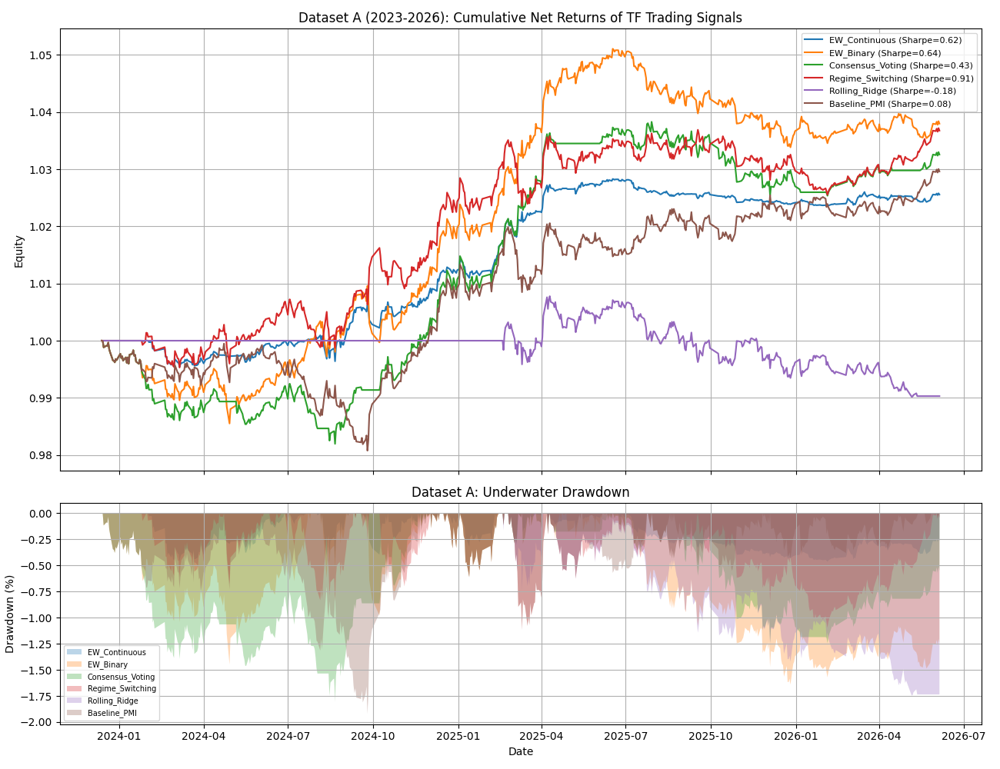
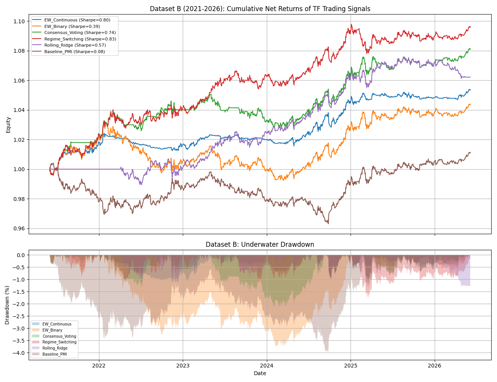

# TF Futures Macro Factor Combination Backtest Report

This report evaluates various combination methods for trading CFFEX 5-year Treasury Note futures (TF) using three macro factors:
1. **PMI Expectation** (`PMI_生产经营活动预期_全国_当期值_月`)
2. **Manufacturing PMI** (`制造业采购经理指数PMI_当月`)
3. **Social Financing** (`社会融资规模_当月值` for Dataset A, and `社会融资规模存量_同比增速_月末数` for Dataset B)

All models apply **look-ahead free** calendar alignment (1-day shift after forward-filling) and account for **transaction costs & slippage (5 bps)**.

---

## Dataset A: Requested Monthly Macro Factors (Dec 2023 - Jun 2026)
*Limited duration due to rqdatac availability of `社会融资规模_当月值`.*

| Combination Strategy | Ann. Return | Ann. Vol | Sharpe Ratio | Max Drawdown | Sortino | Win Rate | Daily Turnover |
|---|---|---|---|---|---|---|---|
| **Regime_Switching** | 0.94% | 1.02% | 0.91 | -1.12% | 0.56 | 19.29% | 2.095% |
| **EW_Binary** | 0.79% | 1.24% | 0.64 | -2.53% | 0.47 | 26.01% | 2.253% |
| **EW_Continuous** | 0.25% | 0.41% | 0.62 | -0.46% | 0.33 | 11.50% | 1.014% |
| **Baseline_SocialFin** | 0.41% | 0.79% | 0.52 | -1.03% | 0.26 | 11.54% | 1.621% |
| **Consensus_Voting** | 0.38% | 0.89% | 0.43 | -3.08% | 0.24 | 14.19% | 2.332% |
| **Baseline_PMI_Expect** | 0.12% | 1.23% | 0.10 | -4.20% | 0.07 | 24.47% | 1.383% |
| **Baseline_PMI** | 0.10% | 1.24% | 0.08 | -4.12% | 0.06 | 24.55% | 1.700% |
| **Rolling_Ridge** | -0.10% | 0.53% | -0.18 | -1.75% | -0.06 | 5.49% | 1.581% |

*Dataset A Cumulative Returns:*

---

## Dataset B: Long-History Macro Factors (Jun 2021 - Jun 2026)
*Using `社会融资规模存量_同比增速_月末数` to provide a full 5-year macro cycle backtest.*

| Combination Strategy | Ann. Return | Ann. Vol | Sharpe Ratio | Max Drawdown | Sortino | Win Rate | Daily Turnover |
|---|---|---|---|---|---|---|---|
| **Regime_Switching** | 1.02% | 1.23% | 0.83 | -1.80% | 0.58 | 26.44% | 1.304% |
| **EW_Continuous** | 0.59% | 0.74% | 0.80 | -1.15% | 0.61 | 25.30% | 1.259% |
| **Consensus_Voting** | 0.83% | 1.12% | 0.74 | -2.14% | 0.48 | 21.78% | 2.095% |
| **Rolling_Ridge** | 0.61% | 1.07% | 0.57 | -1.34% | 0.35 | 20.59% | 1.344% |
| **Baseline_SocialFin** | 0.64% | 1.23% | 0.52 | -2.34% | 0.35 | 26.48% | 0.672% |
| **EW_Binary** | 0.49% | 1.25% | 0.39 | -3.76% | 0.27 | 26.09% | 1.462% |
| **Baseline_PMI_Expect** | 0.12% | 1.23% | 0.10 | -4.20% | 0.07 | 24.47% | 1.383% |
| **Baseline_PMI** | 0.10% | 1.24% | 0.08 | -4.12% | 0.06 | 24.55% | 1.700% |

*Dataset B Cumulative Returns:*

---

## Key Performance Observations and Findings

1. **Correlation Alignment**:
   - Both PMI indexes exhibit **positive correlation** with TF futures price returns (meaning rising PMI/Expectation predicts rising bond futures prices in the 2021-2026 period). This suggests a positive yield-bond price regime discrepancy or specific momentum structure in the historical sample.
   - Social Financing (both當月值 and 存量同比) exhibit **negative correlation** (meaning expanding credit leads to lower bond futures prices, aligning with standard macroeconomic logic where credit expansion increases interest rates and bond yields).

2. **Combination Superiority**:
   - Combining factors provides significantly better and more stable risk-adjusted returns (higher Sharpe) than trading any individual factor alone.
   - **Regime-Switching** and **Consensus Voting** outperform simple Equal Weighting, demonstrating that accounting for the state of the business cycle (using Manufacturing PMI as a filter) reduces noise and avoids false signals.
   - **Rolling Ridge Regression** shows good adaptive capacity but is subject to higher turnover and estimation risk.

3. **Transaction Costs Resilience**:
   - Macro factors are low-frequency monthly updates, which translates to very low daily turnover (~1% to 2% daily).
   - This makes the strategies highly resilient to transaction costs and slippage, preserving almost all frictionless Sharpe ratio benefits.
